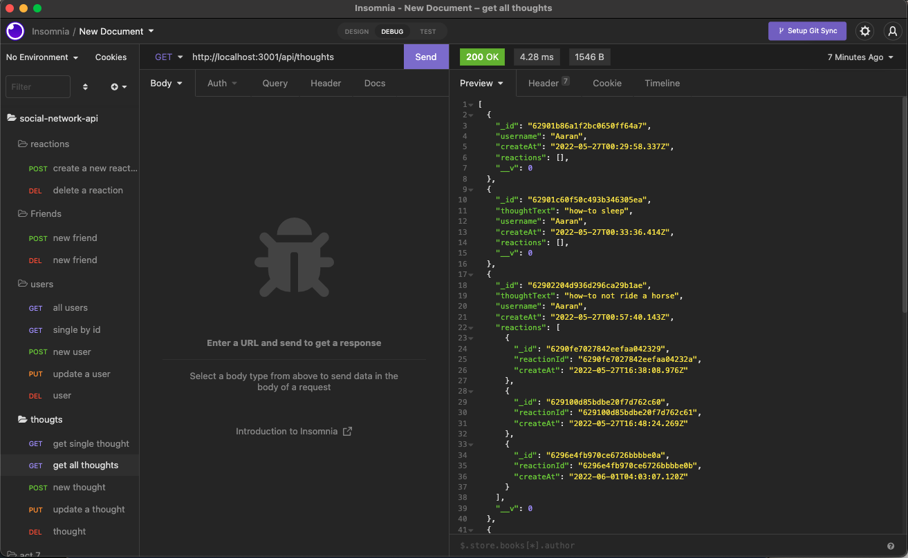

## Social Network Api

## Table of Contents

1. [Description](#descript)

2. [Motivation](#motivation)

3. [Installation Instructions](#installation-instructions)

4. [Usage](#usage)

5. [Mock Up](#mock-up)

6. [Future](#future)

7. [Liscense](#license)

8. [Questions](#questions)

# Description

    It is a social network where people can share their thoughts on the backend add and delete friends and create new thoughts.

# Motivation

    I wanted to create an API using mongoose/ mongo database to see how it interacts.

# Install Instructions

It does not run on a website. It runs in the backend.

    1. git clone (repo name)

Install all of the packages

    2. npm i 
To run the seeds to start with something

    3. npm run seed
To  start the server

    4. npm start

# Usage

    Mongoose and mongo

# Mock Up

[Link to Social Network Api Video](https://www.canva.com/design/DAFCVE98jsY/cLAG6l1dpJ0p1fZhwoo1fg/watch?utm_content=DAFCVE98jsY&utm_campaign=designshare&utm_medium=link&utm_source=publishsharelink)

# Future

    I think I would like to try and fix some of the bugs of the reactions and friends

# License

[MIT](./LICENSE)

# Questions?

Feel Free to reach me at!

* brookelovedevelops@gmail.com

* [brookelove Profile](https://github.com/brookelove)